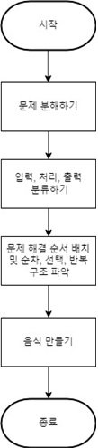

# 1117 학습내용
## 캡스톤2 프로그램 DFD

## 캡스톤2 프로그램 순서도

## 구현
본 프로젝트의 산출물은 VR 프로그램이다. VR 프로그램 개발을 위해 VR 엔진인 Unity를 사용한다. VR기기는 Oculus Quest2를 사용할 예정이며 Unity에서는 VR 기기인 Oculus Quest2를 지원하고 있다. Unity 내에서 오브젝트를 제어하는 스트립트는 C#으로 작성한다. VR 기기 내에서 사용할 수 있는 콘텐츠 개발을 위해 안드로이드 플랫폼을 선정하였고, 운영체제는 Windows 10을 사용한다.